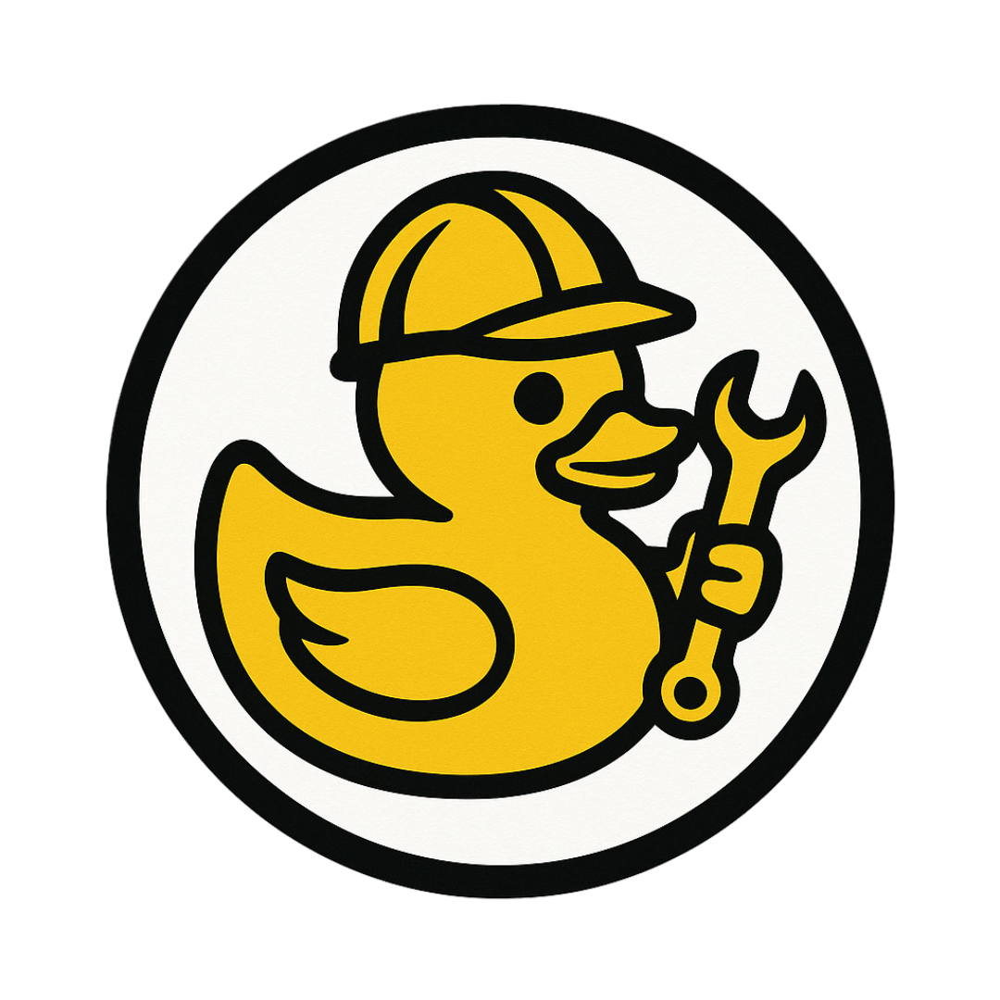

# DuckDev Tools

A comprehensive collection of essential developer tools that work entirely offline in your browser. No server required, no tracking, complete privacy guaranteed.

<div align="center">
  
</div>

Try it out at [https://baptiste-mnh.github.io/duckdev-tools/](https://baptiste-mnh.github.io/duckdev-tools/)

## 🚀 Features

**🔒 Privacy First**

- Everything runs locally in your browser
- No data sent to external servers
- No tracking or analytics
- Works completely offline

**🛠️ Developer Tools Collection**

- **JWT Creator** 🔐 - Create and decode JWT tokens with different signature algorithms
- **Password Generator** 🔑 - Generate secure passwords with customizable criteria
- **Encoder/Decoder** 🔄 - Encode and decode data in Base64, URL, HTML, Hex, Binary, ROT13, and Caesar Cipher
- **Color Palette** 🎨 - Create harmonious color palettes with CSS export
- **Regex Tester** 🔍 - Test and validate regular expressions in real-time
- **Logo Creator** 🖼️ - Generate app logos from PNG files with customizable formatting options

**💾 Smart Features**

- Progressive Web App (PWA) support
- Offline functionality
- Local storage for preferences
- Favorites system
- Usage statistics
- Tool history tracking

## 🌐 Live Demo

Visit [https://baptiste-mnh.github.io/duckdev-tools/](https://baptiste-mnh.github.io/duckdev-tools/) to try it out!

## 🏃‍♂️ Quick Start

### Prerequisites

- Node.js 18+
- npm or yarn

### Installation

```bash
# Clone the repository
git clone https://github.com/baptiste-mnh/duckdev-tools.git

# Navigate to project directory
cd duckdev-tools

# Install dependencies
npm install

# Start development server
npm run dev
```

The application will be available at `http://localhost:5173`

### Build for Production

```bash
# Build the application
npm run build

# Preview the production build
npm run preview
```

## 🔧 Available Scripts

- `npm run dev` - Start development server
- `npm run build` - Build for production
- `npm run preview` - Preview production build
- `npm run lint` - Run ESLint

## 🏗️ Built With

### Core Technologies

- **[React](https://reactjs.org/)**
- **[TypeScript](https://www.typescriptlang.org/)**
- **[Vite](https://vitejs.dev/)**
- **[TailwindCSS](https://tailwindcss.com/)**

### State Management & Routing

- **[Zustand](https://github.com/pmndrs/zustand)**
- **[React Router DOM](https://reactrouter.com/)**

### UI & UX

- **[Lucide React](https://lucide.dev/)**
- **[Sonner](https://sonner.emilkowal.ski/)**

### Development Tools

- **[ESLint](https://eslint.org/)**

## 📝 License

This project is licensed under the MIT License - see the [LICENSE](LICENSE) file for details.

## 👨‍💻 Author

**Baptiste M** ([@baptiste-mnh](https://github.com/baptiste-mnh))

## 🐛 Found a Bug?

If you find a bug or want to request a new feature, please [open an issue](https://github.com/baptiste-mnh/duckdev-tools/issues) on GitHub.

---

**Made with ❤️ for developers, by a developer**
